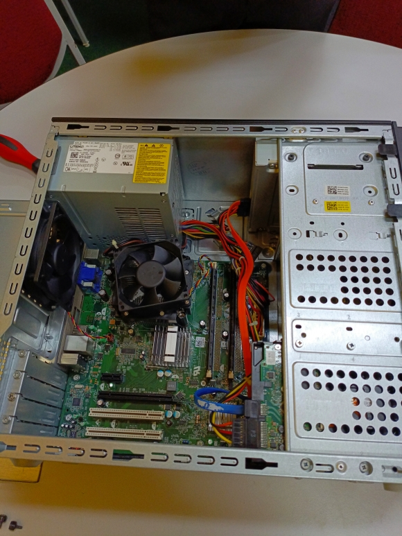

# 💻 SECP1513 Technology and Information System
⌨️ Technology and Information System is a course that gives us knowledge about current technologies and advancements. Including hardware, software, cybersecurity and etc.  
🚌 This course also brings us to industry visit, which allows us to bridge the gap between theory and real-life.  
🗣️ Additionally, this course also invited experienced speakers to conduct industry talks for student, enabling students to gain valuable insights from the successful person.

# ⌛ Timeline 

| Date | Activities   |
|--|--|
|22.10.2024 | PC Assemble Lab Session |
|19.11.2024 | Industry Talk by CEO of Run Cloud |
|10.12.2024 | Industry Visit to UTM Digital|
|17.12.2024 | Industry Talk by Chief of Executive Officer of Micro Semiconductor Sdn. Bhd |
|17.12.2024 | Industry Talk by IT Officer in UTM Digital |
|17.1.2025 | Industry Visit to Petronas |

# 🖥️ PC Assemble (22.10.2024)
</td>
- Reflection:
> Through this lab session, I am able to recognise different components and hardwares in computer. The moment that the computer successfully started, it was very fufilling. 

# 📒 Design Thinking Project
🎼 We were assigned the theme **"Big Data and Artificial Intelligence Innovation"** to develop solutions addressing real-world problems. 
🤯 After brainstorming, we decided to develop a product called "MBTI-Personalized Playlist and Quotes" to address the challenges people face when selecting music for their listening experience. 
📂 Report for Design Thinking Project : [MBTI-Personalized Playlist and Quotes](https://github.com/XinYing0905/tis/blob/main/TIS%20GROUP%204%20PROJECT%20REPORT%20checked%20(1).pdf)
- Reflection:
> Through this project, my critical thinking skills was sharpened, as well as my communication skills and leadership skills. It was fun to work with other teammates, as the saying goes "one person can walk fast, but a group of people can go far".

# 🏡 Industry Visit to UTM Digital (10.12.2024)
</td> 
🏚️ This is our first industry visit and we gained a lot of insights in this visit.  
🔭 We got to see daily life as a programmer, and get valueble input from talk given by UTM Digital staff. 
📽️ Link to the video : [Industry Visit 1](https://youtu.be/vj_jHPLiTjo)
- Reflection:
> Through this visit, I gained insights on the organisation structure of UTM Digital, and services offer by them. The most exciting thing, is the interview with UTM Digital staff. It was very insightful. 

# 🎤 Industry Talk (17.12.2024)
 
📝 We wrote a report in academic writing style to summarize the industry talk given by two distinguished speakers.  
🖋️ Academic report for this industry talk : [Report](https://github.com/XinYing0905/tis/blob/main/TIS%20GROUP%204%20ACADEMIC%20REPORT.pdf)
- Reflection:
> Throughout this talk, we learn about the career path after graduation, explored different possibilities to success in IT sector. We are not fixed in particular occupation, we can also be an entrepreneur with a computer science degree.

# Industry Visit to Petronas
- Reflection:
> Through this visit...

# 📘 Learning Material
Chapter 1 : [Emerging Technology in ICT](https://github.com/XinYing0905/tis/blob/main/10%20CHAPTER%201%20-%20EMERGING%20TECHNOLOGY%20IN%20ICT%20.pdf) 
Chapter 2 : [Hardware](https://github.com/XinYing0905/tis/blob/main/20%20CHAPTER%202%20-%20HARDWARE%20.pdf) 
Chapter 3 : [Software](https://github.com/XinYing0905/tis/blob/main/CHAPTER%203%20-%20SOFTWARE%20.pdf) 
Chapter 4 : [Information System and System Analysis and Design](https://github.com/XinYing0905/tis/blob/main/40%20CHAPTER%204%20-%20INFORMATION%20SYSTEM%20AND%20SAD%20.pdf) 
Chapter 5 : [Databases and Data Analytics](https://github.com/XinYing0905/tis/blob/main/5.0%20CHAPTER%205%20-%20DATABASES%20AND%20DATA%20ANALYTICS%202023.pdf) 
Chapter 6 : [Networks and Communications](https://github.com/XinYing0905/tis/blob/main/6.0%20CHAPTER%206%20-%20NETWORK%20%26%20COMMUNICATION%202023.pdf) 
Chapter 7 : [Privacy and Security Ethics](https://github.com/XinYing0905/tis/blob/main/7.0%20CHAPTER%207%20-%20PRIVACY%20%26%20SECURITY%20ETHICS%202023%20.pdf) 
Chapter 8 : [Cloud Computing](https://github.com/XinYing0905/tis/blob/main/8.0%20CHAPTER%208%20-%20CLOUD%20COMPUTING%202023%20(2).pdf) 

# Reflection
I gained valuable knowledge about technologies and information systems through industry talks and visits. These experiences have significantly benefited me, providing insights into my potential future career in the IT sector. They offered practical knowledge that goes beyond what books can teach. For instance, during an interview with UTM Digital staff, I learned about the critical role of communication skills in the workplace. One memorable piece of advice that resonated with me was: **"Interest is the key to help you stay optimistic in your work."**

